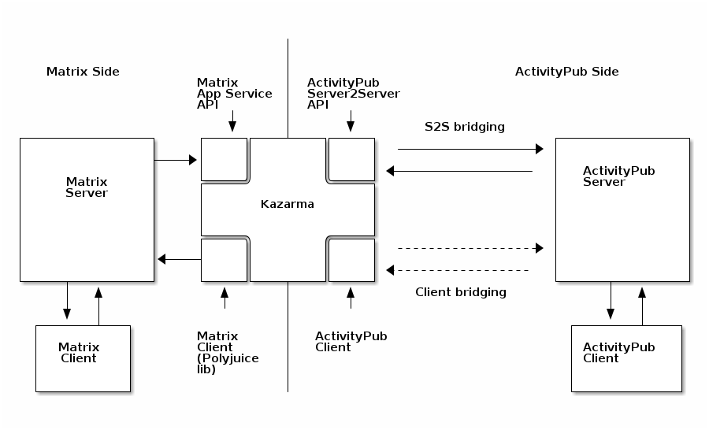

# Kazarma

## A Matrix-ActivityPub bridge

A Matrix bridge to ActivityPub. It uses [this ActivityPub library](https://github.com/commonspub/ActivityPub) and [those](https://gitlab.com/kazarma/matrix_app_service.ex) Matrix [libraries](https://gitlab.com/uhoreg/polyjuice_client).



## Resources

- Installation
- [Specs](https://gitlab.com/kazarma/kazarma/-/wikis/Specs)
- [API documentation](https://kazarma.gitlab.io/matrix_app_service.ex)

## Development environment

### Using Docker

```bash
git submodule update --init --recursive
docker-compose run synapse generate
docker-compose run kazarma mix do deps.get, ecto.setup
docker-compose up
```

To use `docker-hoster` to make container domains accessible (careful, mounting the Docker socket **will give root access on your host to the mounted `docker-hoster` container**):
```
docker run -d \
    -v /var/run/docker.sock:/tmp/docker.sock \
    -v /etc/hosts:/tmp/hosts \
    --name docker-hoster \
    dvdarias/docker-hoster@sha256:2b0e0f8155446e55f965fa33691da828c1db50b24d5916d690b47439524291ba
```

This should run containers with those services:
- [kazarma.kazarma.local:4000](http://kazarma.kazarma.local:4000) -> Kazarma itself
- [synapse.kazarma.local:8008](http://synapse.kazarma.local:8008) -> Synapse (Matrix server)
- [kazarma.local](http://kazarma.local) -> serves .well-known routes that allow Matrix and Kazarma.ActivityPub to use simple `kazarma.local` domain (for users, etc)
- [pleroma.local](http://pleroma.local) -> Pleroma, should be able to address Matrix users using `kazarma.local` domain
- [element.local](http://element.local) -> Element, will connect to Synapse, should then be able to address Pleroma users using `pleroma.local` domain

### Locally

```bash
git submodule update --init --recursive
mix ecto.setup
iex -S mix phx.server
```

### Use git-over-SSH when working with submodules

Submodules use HTTPS so they can be easily pulled from automated systems.
To use SSH when contributing, follow [these instructions](https://stackoverflow.com/questions/11200237/how-do-i-get-git-to-default-to-ssh-and-not-https-for-new-repositories/36500841#36500841).

### Generate Doc

We use [ditaa](http://ditaa.sourceforge.net) to generate diagrams and integrate them into HexDoc.
- Install [ditaa](http://ditaa.sourceforge.net).
- Launch : `rm doc_diagrams/*.png && ditaa doc_diagrams/*.html && mix docs`

To edit diagrams use [asciiflow](http://asciiflow.com/) and paste the result in HTML files in the `doc_diagrams` folder.

## Sponsors

The [NLNet foundation](https://nlnet.nl/) [selected this project](https://nlnet.nl/project/Matrix-CommonsPub/) as part of the Next Generation Internet initiative (thank you!).

They redistribute public European funding (EU'S R&D programme called "Horizon 2020") to finance programming efforts on a "resilient,trustworthy and sustainable" Internet. if you're interested, [check out how to apply in this video](https://media.ccc.de/v/36c3-10795-ngi_zero_a_treasure_trove_of_it_innovation)!
